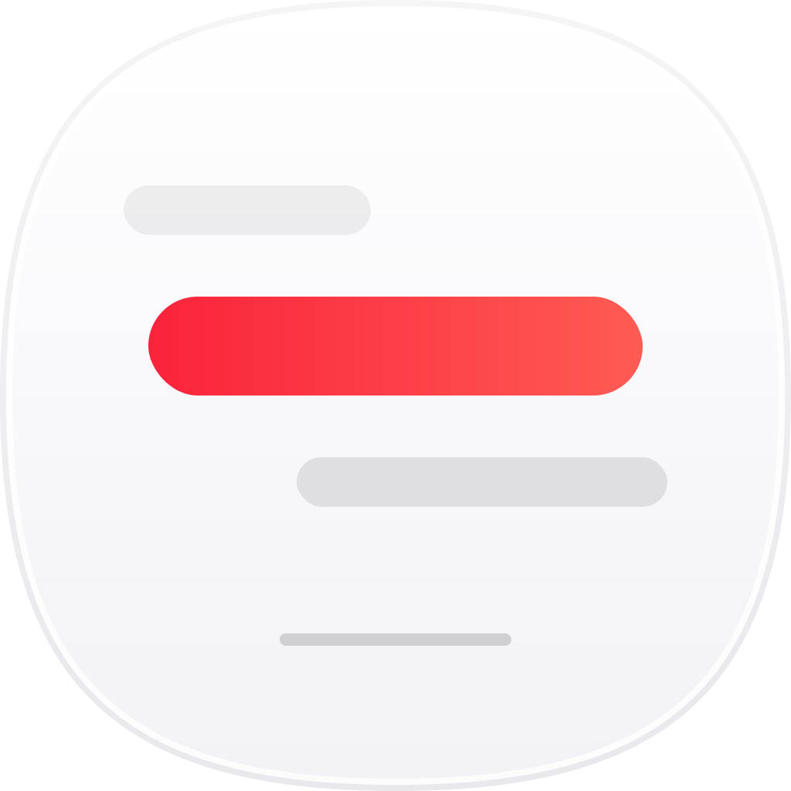

<h1 align="center">
   
  
   
  LyricDock
   
</h1>

    
    
    
	

    <a href="README_cn.md"><b>中文</b></a> •
    <a href="README.md"><b>English</b></a>

    <strong> LyricDock </strong> 是一个 macOS 菜单栏歌词播放器伴侣。纯菜单栏应用，不依赖主窗口，支持右键菜单调节菜单栏宽度、开机自启，超长歌词会自动滚动显示，兼容MacOS 26，并支持多款音乐软件。

## 🌟 程序特性

- 支持右键菜单调节菜单栏宽度、开机自启和退出
- 切歌后会先显示 `歌名 · 歌手`，再切到歌词
- 超长歌词会自动滚动显示
- 过滤网页等非目标播放源，避免菜单栏被异常接管
- 优化 CPU 占用，播放时仅占用 1-3% CPU
- 优化内存占用，空闲时自动清理缓存

## ⬇️ 当前支持的播放源

- Apple Music
- Spotify
- 汽水音乐
- 网易云音乐
- QQ 音乐

其中：

- Apple Music / Spotify 走专用控制链路
- 汽水音乐 / 网易云音乐 / QQ 音乐 优先走系统 now playing 适配

- 歌词来自 `LRCLIB`
- 支持 LRC 时间轴解析
- 支持 14 天歌词缓存
- 封面优先使用播放器自身 artwork，拿不到时再回退歌曲匹配

## 👋 下载与安装

👉 前往 [Github Releases](https://github.com/Yeezy7/LyricDock/releases)下载

🐛 如果需要任何问题，请提交 [issues](https://github.com/Yeezy7/LyricDock/issues)

## 📌 版本改动

### v1.0.2
- 优化 CPU 占用，播放时仅占用 1-3% CPU
- 优化内存占用，空闲时自动清理缓存
- 移除自动检查更新功能
- 修复菜单预览问题

## 🚀 未来计划

- 重新实现自动更新功能
- 支持更多音乐播放器
- 增加下拉歌词列表功能
- 优化歌词匹配算法

## 🔑 许可证

当前仓库使用 `MIT License`，见 [LICENSE](/Users/ikun/Documents/code/Projects/APP/LyricDock/LICENSE)。
